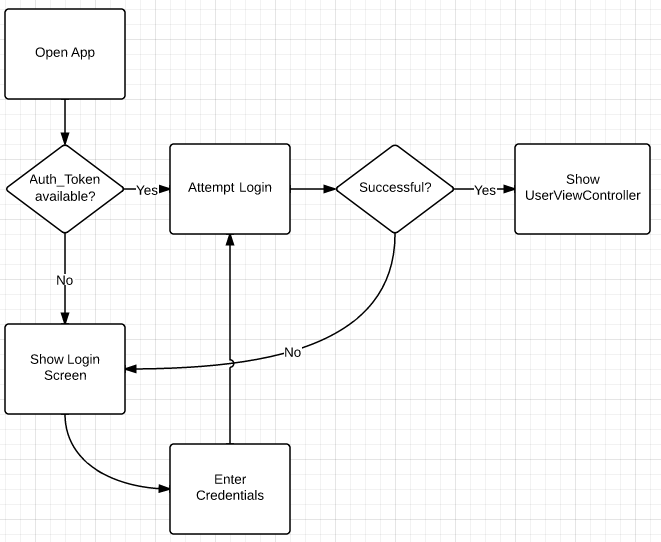

<h1>(21) Authentication In React</h1>

### Penjelasan
Fungsi menentukan hak akses/hak istimewa terhadap sumber daya, yang berkaitan dengan keamanan informasi umum dan keamanan komputer, dan kontrol akses pada khususnya. Secara lebih formal, "mengotorisasi" berarti mendefinisikan kebijakan akses.

|React App||Backend|
|-----|----|-----|
|User Registration|1. POST api/auth/signup {username, email, password}   3. Return Message ("Registered successfully!") |2. Check Existing save user to database|
|User Login|1. POST api/auth/signin{username, password}  3. Return JwtResponse {token, type, user info, authorities}|2. Authenticate {username, password} create JWT string with a secret. |
|Access Resource|4. Request data with JWT on Header   6. Return response based on Authorities| 5. Check JWT signature get user info & authenticate Authorize using user's authorities. |

### Login 
Dalam keamanan komputer, Logging adalah proses di mana seseorang memperoleh akses ke sistem komputer dengan mengidentifikasi dan mengautentikasi dirinya sendiri.

Dengan cara : memasukan email/username, password.

### Simple Login
